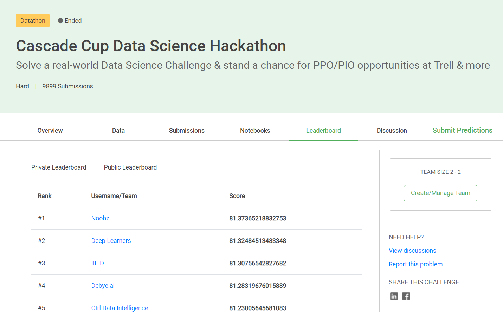

# Cascade Cup - The Ultimate Data Science Challenge Round 2 Solution
### Result: Our Team Deep-Learners ranked 2nd out of 251 participants.
Model Used : We used Different Classifier models as a base estimators to generate out of fold predictions using Stacking to be used as features for the final estimator and predicted the class. 
Challenge Link : https://dphi.tech/practice/challenge/46#problem/  
Leaderboard Link: https://dphi.tech/practice/challenge/46#leaderboard/  
### Rank Screenshot : 

